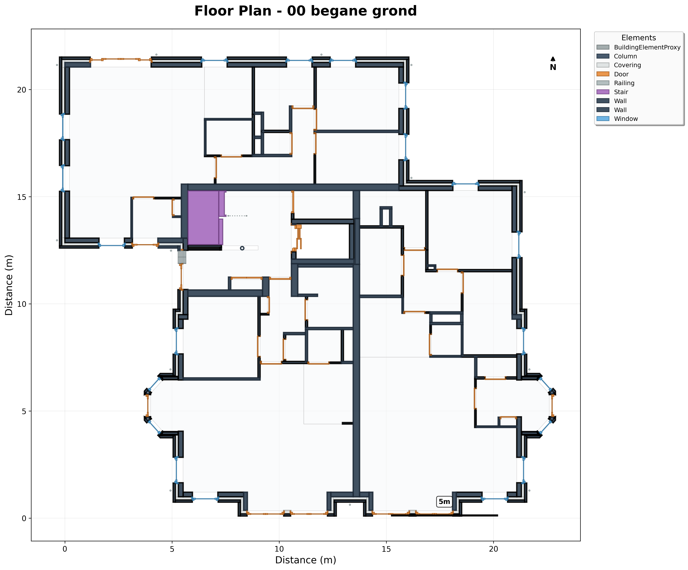
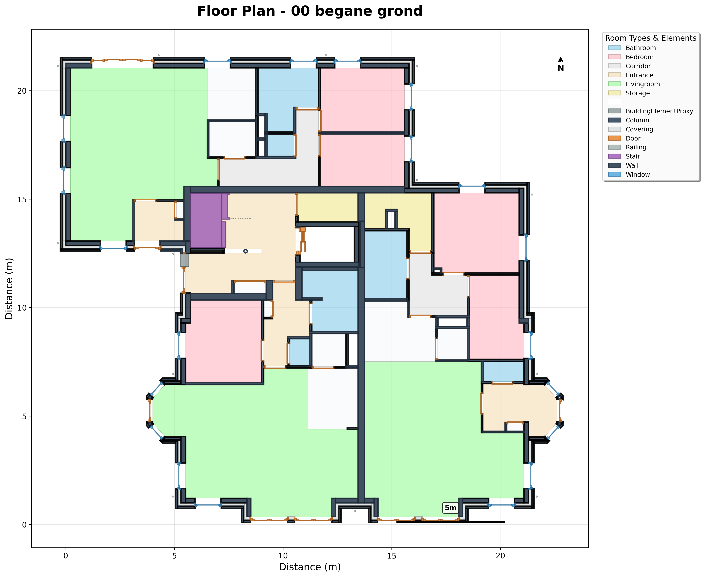
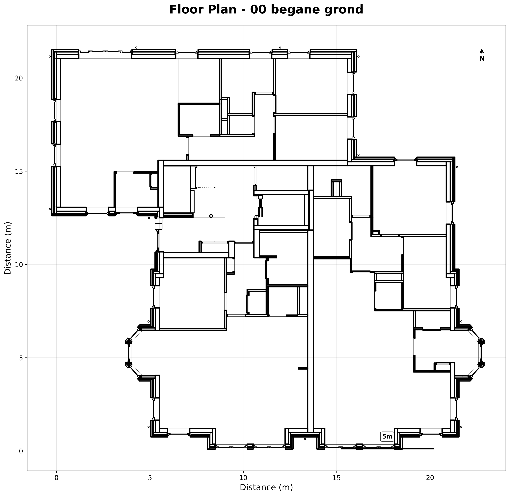

# ifc2plan

[](https://www.python.org/downloads/)
[](https://opensource.org/licenses/MIT)

> Extract geometric data (CSV/WKT) and 2D floor plans from IFC building models

## Features

📊 **Export geometric data** as WKT/CSV
✨ **Professional floor plan images** with architectural styling
🎨 **Multiple visual styles** (professional, minimal, colorful, technical)
🌈 **Colored room type visualization** with customizable legends
🏠 **Room naming conversion** (e.g., Dutch to English)
⚡ **Batch processing** for multiple IFC files
🔧 **Robust geometry engine** using Trimesh + Shapely    

## Quick Start

```bash
# Install dependencies
pip install -r requirements.txt

# Show file overview (storeys, element counts)
python extract_floor_plans.py building.ifc --overview

# Extract specific storey only (much faster!)
python extract_floor_plans.py building.ifc --storey 5

# Extract geometric data as CSV/WKT
python extract_floor_plans.py building.ifc

# Generate professional floor plan images with colored room types
python extract_floor_plans.py building.ifc --formatter image wkt --colored-spaces --naming-conversion naming_conversion.csv

# Extract only spaces with room type coloring for one floor
python extract_floor_plans.py building.ifc --storey 0 --space-only --colored-spaces --naming-conversion naming_conversion.csv
```

## Installation

**Requirements:** Python 3.8+

```bash
git clone https://github.com/datarefinerylab/ifc2plan.git
cd ifc2plan
pip install -r requirements.txt
```

## Usage

```bash
# Show file overview first (fast, no geometry processing)
python extract_floor_plans.py building.ifc --overview

# Extract only one storey (much faster than all storeys!)
python extract_floor_plans.py building.ifc --storey 5

# Basic usage (default: professional black & white style)
python extract_floor_plans.py input.ifc

# Extract only spaces with colored room types from storey 0
python extract_floor_plans.py building.ifc \
  --storey 0 \
  --space-only \
  --colored-spaces \
  --naming-conversion naming_conversion.csv

# Generate both colored and black & white versions
python extract_floor_plans.py building.ifc \
  --both \
  --naming-conversion naming_conversion.csv

# Multiple outputs and styling for specific storey
python extract_floor_plans.py building.ifc \
  --storey 2 \
  --output ./plans \
  --formatter image wkt \
  --style colorful \
  --colored-spaces \
  --width 4096

# Batch process multiple files
python extract_floor_plans.py "buildings/*.ifc" --output ./all_plans
```

### Command Line Options

| Option | Description | Default |
|--------|-------------|---------|
| `--overview` | Show IFC file overview without processing geometry | `False` |
| `--storey INDEX` | Process only specific storey by index (0-based) | All storeys |
| `--section-offset` | Cutting plane height above each storey's elevation, in metres | `1.5` |
| `--output` | Output directory | `output` |
| `--formatter` | Output format: `image`, `wkt` (space-separated) | `wkt` |
| `--style` | Visual style: `professional`, `minimal`, `colorful`, `technical` | `professional` |
| `--colored-spaces` | Color spaces by room type (requires naming conversion) | `False` |
| `--both` | Generate both colored and black & white versions | `False` |
| `--space-only` | Extract only IfcSpace elements | `False` |
| `--naming-conversion` | CSV file for room name translation (format: `original,english`) | `None` |
| `--width/--height` | Image dimensions (pixels) | `2048` |
| `--max-elements` | Limit for large files (testing) | `None` |

## Output Structure

```
output/
└── building_name/
    ├── Level_1_floor_plan.png          # Floor plan image (b&w by default)
    ├── Level_1_floor_plan_colored.png  # Colored version (if --both or --colored-spaces)
    ├── Level_1_floor_plan_bw.png       # Black & white version (if --both)
    ├── Level_1_floor_plan.csv          # Geometric data (WKT format)
    └── Level_2_floor_plan.png
    ...
```

## Room Naming Conversion

Create a CSV file with room name translations (e.g., Dutch to English):

```csv
original,english
badkamer,bathroom
slaapkamer,bedroom
woonkamer,livingroom
keuken,kitchen
gang,corridor
berging,storage
balkon,balcony
```

Then use it with:
```bash
python extract_floor_plans.py building.ifc --colored-spaces --naming-conversion naming_conversion.csv
```

## Visual Styles

The tool supports four visual styles, each with optional room type coloring:

### Professional (Default)
Clean architectural style with subtle colors. When `--colored-spaces` is enabled, each room type gets a distinct pastel color.

### Minimal
Black and white style with grayscale room differentiation when colored mode is enabled.

### Colorful
Bright, vibrant colors for presentations. Room types use highly saturated colors in colored mode.

### Technical
Line-only drawings with no fills (architectural drafting style). Room coloring is not applicable.

## Examples

<details>
<summary>📸 View example outputs</summary>

### Professional
Default output with uniform space coloring


### Professional Style with Colored Room Types
With `--colored-spaces` flag, each room type has a distinct color


### Technical Style (Line drawings)


</details>

## Troubleshooting

**No floor plans generated?**
- Ensure your IFC file contains `IfcBuildingStorey` elements
- Try `--max-elements 100` for testing large files
- Check that `--formatter image` is specified if you want image outputs

**Room types not colored?**
- Ensure you use `--colored-spaces` flag
- Provide a naming conversion CSV with `--naming-conversion`
- Check that room names in IFC match entries in your CSV (case-insensitive)

**AttributeError: 'float' object has no attribute 'lower'?**
- Remove empty rows from your naming conversion CSV file
- Ensure all entries in the CSV have both original and translated names

**Memory issues?**
- Use `--max-elements` to limit processing
- Process files individually instead of batch

**Processing very slow?**
- Larger files take longer - this is normal
- Check that your system isn't running other intensive tasks
- Try with a smaller test file first using `--max-elements 100`

## Origin

`ifc2plan` began as a fork of [byildiz/BatchPlan](https://github.com/byildiz/BatchPlan)
and was renamed after diverging substantially from it. It is a derivative work, MIT
licensed, and the original copyright is retained — see [LICENSE](LICENSE).

- Derived from [`byildiz/BatchPlan@4958a6f`](https://github.com/byildiz/BatchPlan/commit/4958a6f).
  This repository's history was truncated to its own work, so the original commits are
  **not** in this history — they remain in `byildiz/BatchPlan`. The root commit here
  records the derivation.
- The OpenCASCADE/SWIG geometry pipeline of the original was replaced with a
  [Trimesh](https://trimsh.org/) + [Shapely](https://shapely.readthedocs.io/) engine
  (`src/ifc2plan/geometry_engine.py`, `src/ifc2plan/ifc_processor.py`).
- The original's material/LCA database tooling was removed; this repository is scoped to
  floor plan and geometry extraction.

The former repository, `datarefinerylab/BatchPlan`, is archived and read-only.

---

**Built with:** [IfcOpenShell](https://ifcopenshell.org/) • [Trimesh](https://trimsh.org/) • [Shapely](https://shapely.readthedocs.io/)